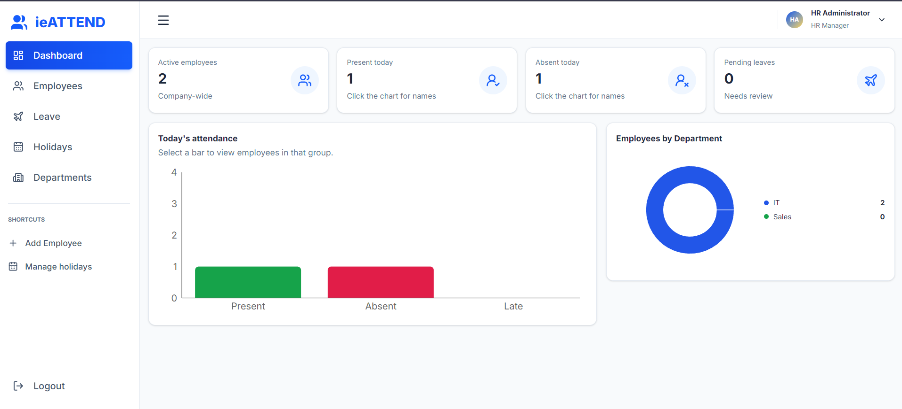
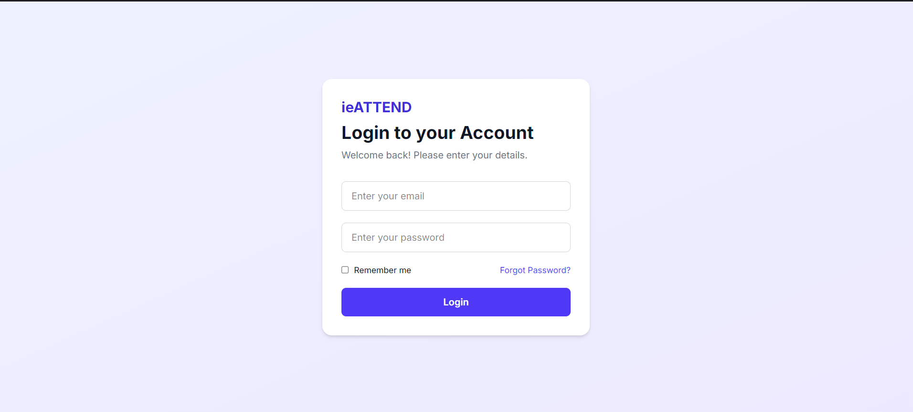
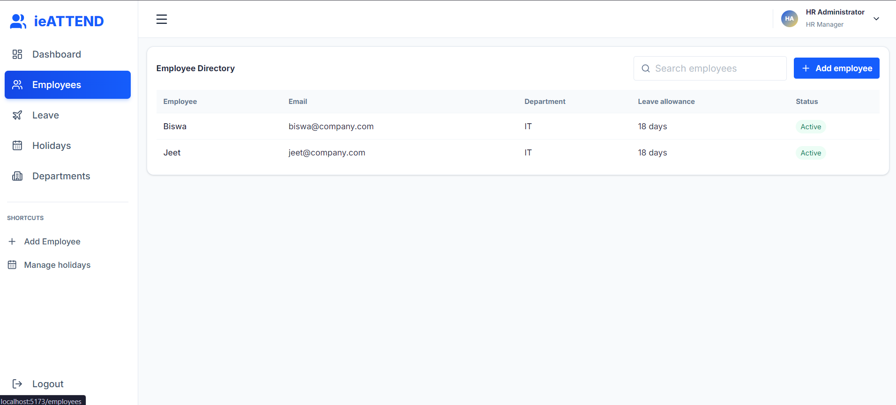
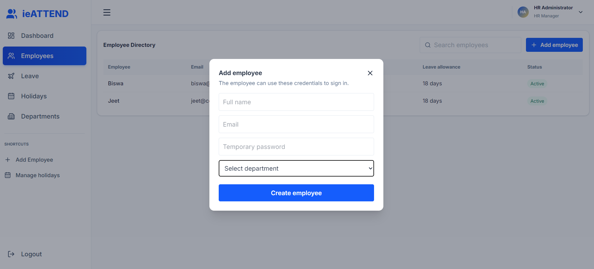
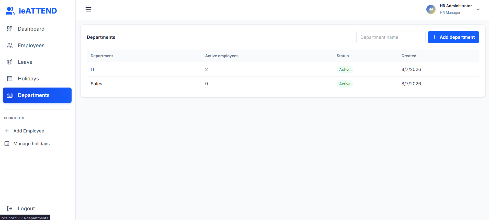
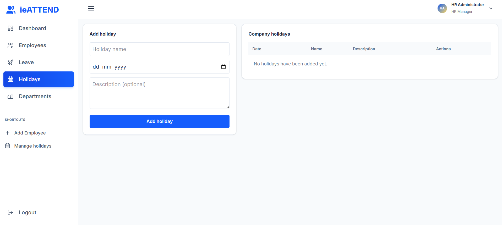
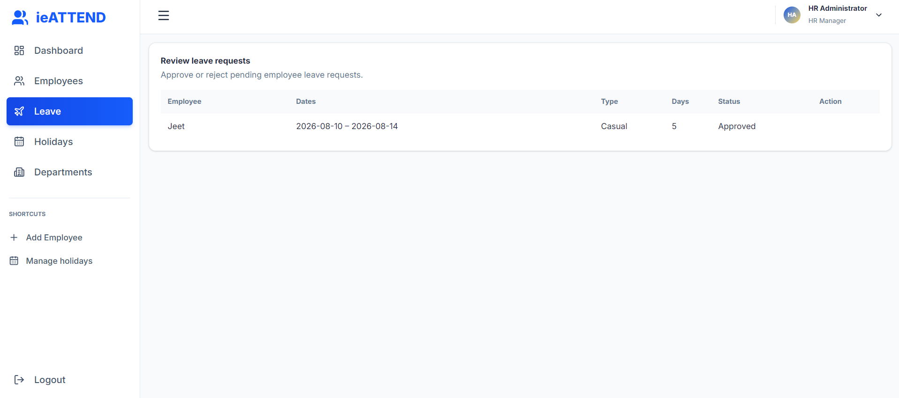
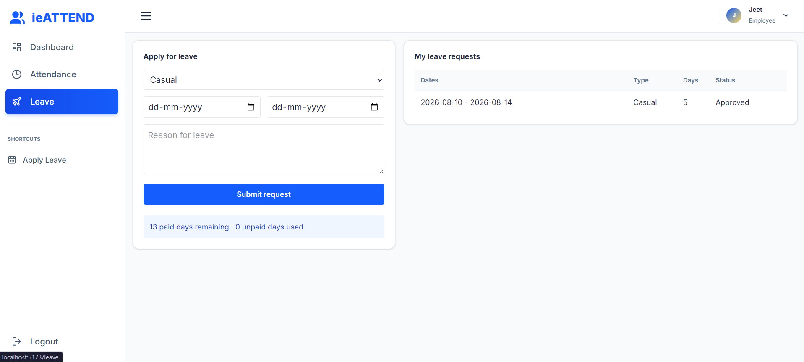
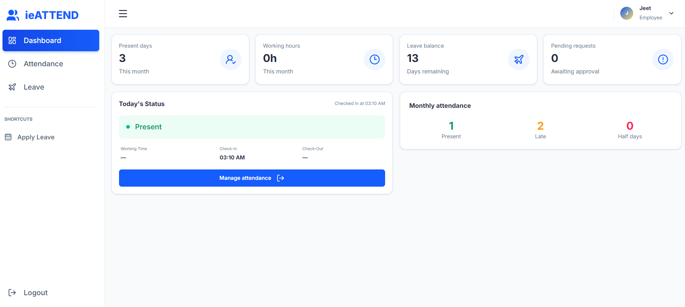
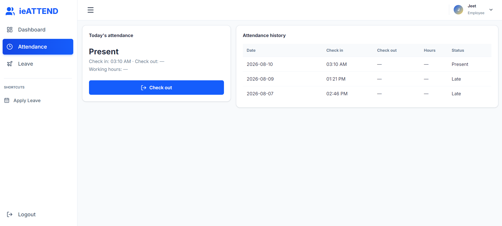

# ieATTEND

> A clean, role-based attendance and leave-management workspace for modern teams.

ieATTEND brings employee directories, daily attendance, leave workflows, holidays, and department management into one focused experience. HR teams get the oversight they need, while employees get a simple self-service portal for checking in and managing time away.

<p align="center">
  
</p>

## Highlights

| HR administrators | Employees |
| --- | --- |
| Monitor company-wide attendance and department distribution | Check in/out and review attendance history |
| Create employee accounts and organise departments | See monthly attendance and leave balance at a glance |
| Review leave requests and manage company holidays | Submit and track leave requests independently |

## Features

- **Role-based access** — dedicated HR Administrator and Employee experiences, protected with JWT authentication.
- **Live dashboards** — concise attendance, leave, and department-level metrics with visual summaries.
- **Employee management** — searchable directory, employee creation, leave allowances, and active-status visibility.
- **Attendance tracking** — check in/out workflows plus a personal history of attendance and working hours.
- **Leave management** — employees request leave; HR can review, approve, or reject it.
- **Organisation setup** — create departments and maintain a company holiday calendar.

## Product tour

### Welcome & HR workspace

<p align="center">
  
  
</p>

### People & organisation

<p align="center">
  
  
</p>

<p align="center">
  
  
</p>

### Leave workflows

<p align="center">
  
  
</p>

### Employee attendance

<p align="center">
  
  
</p>

## Tech stack

- **Frontend:** React 19, Vite, Tailwind CSS, React Router, React Query, Recharts, Axios, Lucide
- **Backend:** ASP.NET Core 10 Web API, Entity Framework Core, JWT Bearer authentication
- **Data:** SQLite
- **API documentation:** Swagger (in Development)

## Getting started

### Prerequisites

- [.NET SDK 10](https://dotnet.microsoft.com/download)
- [Node.js](https://nodejs.org/) (current LTS recommended)

### 1. Start the API

```powershell
dotnet run --project HRMS
```

The API starts at `https://localhost:7207` (and `http://localhost:5169`). In the Development environment, browse to `https://localhost:7207/swagger` for interactive API documentation.

### 2. Start the frontend

```powershell
Set-Location Frontend\ieAttendance
npm install
npm run dev
```

Vite will print the local application URL in the terminal. The frontend calls `https://localhost:
/api` by default. To use a different API endpoint, create `Frontend/ieAttendance/.env.local`:

```env
VITE_API_BASE_URL=https://your-api-host/api
```

### Development account

The API creates an initial HR account on first startup:

```text
Email:    hr@hrms.local
Password: Hr@12345
```

> Before deploying, replace the development JWT key and seeded HR credentials in `HRMS/appsettings.json` with secure, environment-specific configuration.

## API overview

| Area | Key endpoints | Access |
| --- | --- | --- |
| Authentication | `POST /api/auth/register`, `POST /api/auth/login` | Public |
| Attendance | `POST /api/attendance/check-in`, `POST /api/attendance/check-out`, `GET /api/attendance/me` | Employee / HR |
| Leave | `POST /api/leaves`, `GET /api/leaves/me`, `GET /api/leaves/balance` | Employee / HR |
| Leave review | `GET /api/leaves?status=Pending`, `PUT /api/leaves/{id}/review` | HR |
| Employees | `GET /api/employees`, `PUT /api/employees/{id}` | HR |
| Departments | `GET /api/departments`, `POST /api/departments` | HR |
| Holidays | `GET /api/holidays`, `POST /api/holidays`, `PUT /api/holidays/{id}`, `DELETE /api/holidays/{id}` | HR for changes |
| Dashboards | `GET /api/dashboard/employee`, `GET /api/dashboard/hr` | Employee / HR |

## Project structure

```text
HRMS/
├── HRMS/                       # ASP.NET Core API
│   ├── Controllers/             # Auth, attendance, leave, HR administration
│   ├── Data/                    # Entity Framework database context
│   ├── Models/                  # Domain entities
│   └── Services/                # Password hashing and JWT services
├── Frontend/ieAttendance/       # React + Vite application
│   └── src/                     # Pages, components, layouts, and API client
└── docs/screenshots/            # README product screenshots
```

## Security note

This repository is configured for local development. Never commit production secrets or use the bundled development account and JWT key in a deployed environment.
